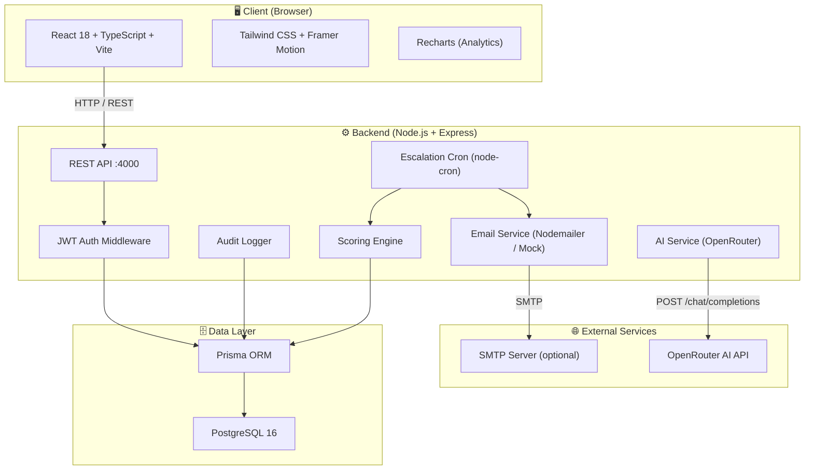
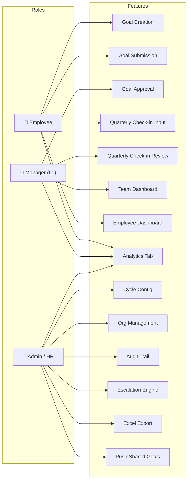
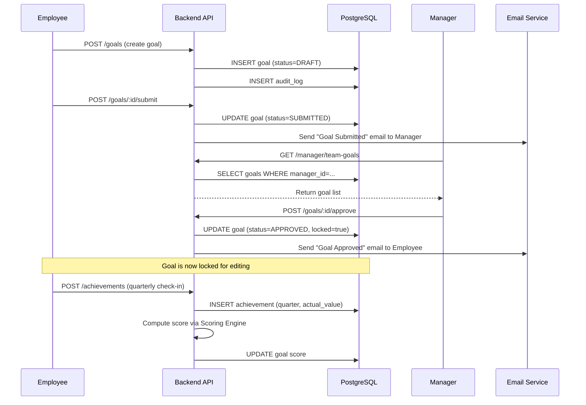
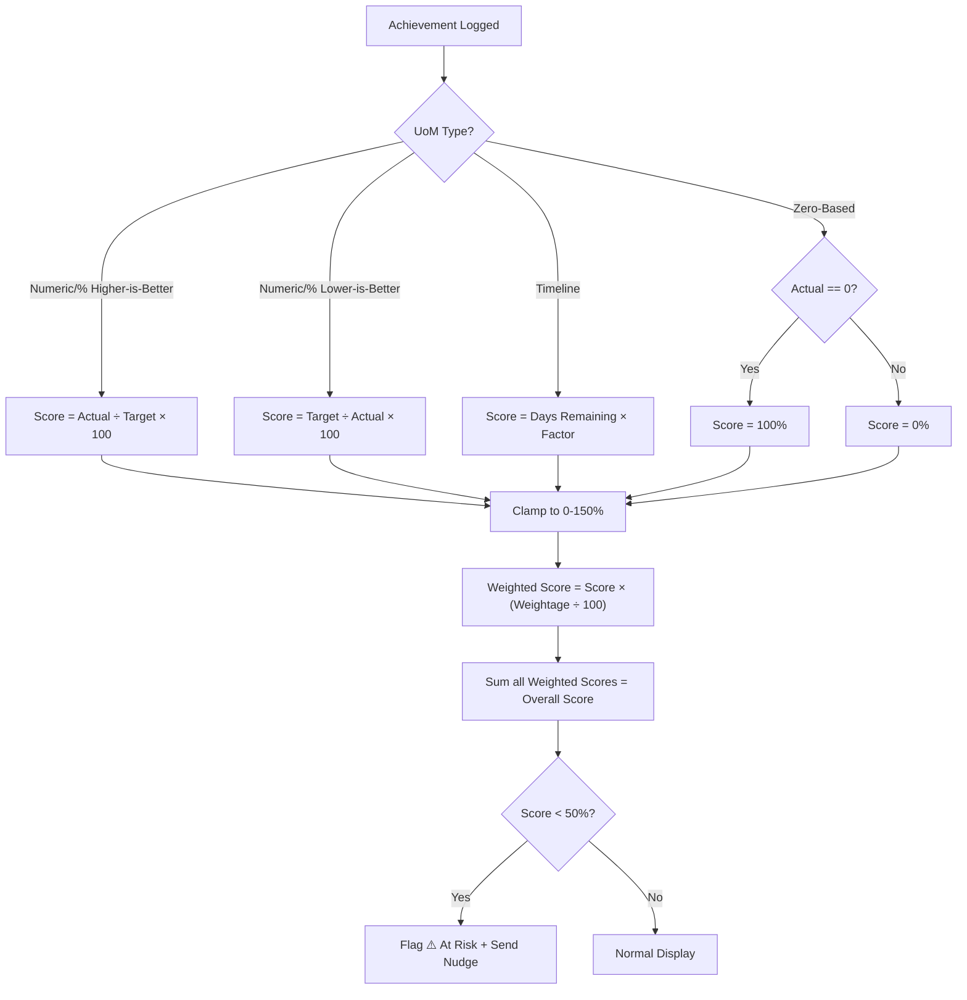
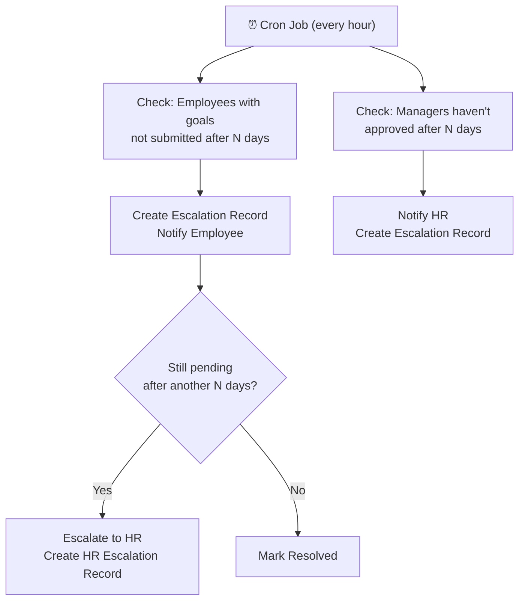
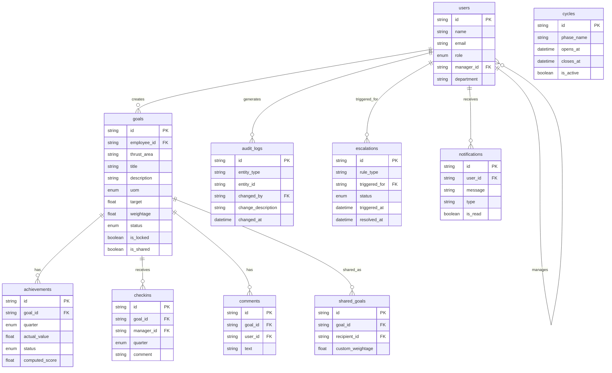

# AtomQuest System Architecture

## High-Level System Overview

```mermaid
graph TB
    subgraph Client["🖥️ Client (Browser)"]
        React["React 18 + TypeScript + Vite"]
        Tailwind["Tailwind CSS + Framer Motion"]
        Recharts["Recharts (Analytics)"]
    end

    subgraph Backend["⚙️ Backend (Node.js + Express)"]
        API["REST API :4000"]
        Auth["JWT Auth Middleware"]
        Audit["Audit Logger"]
        Cron["Escalation Cron (node-cron)"]
        Scoring["Scoring Engine"]
        Email["Email Service (Nodemailer / Mock)"]
        AI["AI Service (OpenRouter)"]
    end

    subgraph Data["🗄️ Data Layer"]
        Prisma["Prisma ORM"]
        PG["PostgreSQL 16"]
    end

    subgraph External["🌐 External Services"]
        OpenRouter["OpenRouter AI API"]
        SMTP["SMTP Server (optional)"]
    end

    React -->|"HTTP / REST"| API
    API --> Auth
    Auth --> Prisma
    Audit --> Prisma
    Cron --> Scoring
    Cron --> Email
    Scoring --> Prisma
    Email -->|"SMTP"| SMTP
    AI -->|"POST /chat/completions"| OpenRouter
    Prisma --> PG
```

## Role Access Matrix

```mermaid
graph LR
    subgraph Roles
        E["👤 Employee"]
        M["👔 Manager (L1)"]
        A["🔑 Admin / HR"]
    end

    subgraph Features
        GC["Goal Creation"]
        GS["Goal Submission"]
        GA["Goal Approval"]
        QI["Quarterly Check-in Input"]
        QR["Quarterly Check-in Review"]
        TDash["Team Dashboard"]
        EDash["Employee Dashboard"]
        Analytics["Analytics Tab"]
        CycleConf["Cycle Config"]
        OrgMgmt["Org Management"]
        Audit["Audit Trail"]
        Escalation["Escalation Engine"]
        Export["Excel Export"]
        SharedGoals["Push Shared Goals"]
    end

    E --> GC
    E --> GS
    E --> QI
    E --> EDash
    E --> Analytics

    M --> GA
    M --> QR
    M --> TDash
    M --> Analytics

    A --> CycleConf
    A --> OrgMgmt
    A --> Audit
    A --> Escalation
    A --> Export
    A --> SharedGoals
    A --> Analytics
```

## Data Flow — Goal Lifecycle

```mermaid
sequenceDiagram
    participant E as Employee
    participant API as Backend API
    participant DB as PostgreSQL
    participant M as Manager
    participant EM as Email Service

    E->>API: POST /goals (create goal)
    API->>DB: INSERT goal (status=DRAFT)
    API->>DB: INSERT audit_log
    
    E->>API: POST /goals/:id/submit
    API->>DB: UPDATE goal (status=SUBMITTED)
    API->>EM: Send "Goal Submitted" email to Manager
    
    M->>API: GET /manager/team-goals
    API->>DB: SELECT goals WHERE manager_id=...
    API-->>M: Return goal list
    
    M->>API: POST /goals/:id/approve
    API->>DB: UPDATE goal (status=APPROVED, locked=true)
    API->>EM: Send "Goal Approved" email to Employee
    
    Note over E,DB: Goal is now locked for editing
    
    E->>API: POST /achievements (quarterly check-in)
    API->>DB: INSERT achievement (quarter, actual_value)
    API->>API: Compute score via Scoring Engine
    API->>DB: UPDATE goal score
```

## Scoring Engine

```mermaid
flowchart TD
    A["Achievement Logged"] --> B{"UoM Type?"}
    B -->|"Numeric/% Higher-is-Better"| C["Score = Actual ÷ Target × 100"]
    B -->|"Numeric/% Lower-is-Better"| D["Score = Target ÷ Actual × 100"]
    B -->|"Timeline"| E["Score = Days Remaining × Factor"]
    B -->|"Zero-Based"| F{"Actual == 0?"}
    F -->|"Yes"| G["Score = 100%"]
    F -->|"No"| H["Score = 0%"]
    C --> I["Clamp to 0-150%"]
    D --> I
    E --> I
    G --> I
    H --> I
    I --> J["Weighted Score = Score × (Weightage ÷ 100)"]
    J --> K["Sum all Weighted Scores = Overall Score"]
    K --> L{"Score < 50%?"}
    L -->|"Yes"| M["Flag ⚠️ At Risk + Send Nudge"]
    L -->|"No"| N["Normal Display"]
```

## Escalation Engine

```mermaid
flowchart TD
    Cron["⏰ Cron Job (every hour)"] --> CheckSubmission["Check: Employees with goals\nnot submitted after N days"]
    Cron --> CheckApproval["Check: Managers haven't\napproved after N days"]
    
    CheckSubmission --> EscL1["Create Escalation Record\nNotify Employee"]
    EscL1 --> StillPending{"Still pending\nafter another N days?"}
    StillPending -->|"Yes"| EscHR["Escalate to HR\nCreate HR Escalation Record"]
    StillPending -->|"No"| Resolved["Mark Resolved"]
    
    CheckApproval --> EscHR2["Notify HR\nCreate Escalation Record"]
```

## Database Schema

```mermaid
erDiagram
    users {
        string id PK
        string name
        string email
        enum role
        string manager_id FK
        string department
    }
    goals {
        string id PK
        string employee_id FK
        string thrust_area
        string title
        string description
        enum uom
        float target
        float weightage
        enum status
        boolean is_locked
        boolean is_shared
    }
    achievements {
        string id PK
        string goal_id FK
        enum quarter
        float actual_value
        enum status
        float computed_score
    }
    checkins {
        string id PK
        string goal_id FK
        string manager_id FK
        enum quarter
        string comment
    }
    audit_logs {
        string id PK
        string entity_type
        string entity_id
        string changed_by FK
        string change_description
        datetime changed_at
    }
    escalations {
        string id PK
        string rule_type
        string triggered_for FK
        enum status
        datetime triggered_at
        datetime resolved_at
    }
    cycles {
        string id PK
        string phase_name
        datetime opens_at
        datetime closes_at
        boolean is_active
    }
    notifications {
        string id PK
        string user_id FK
        string message
        string type
        boolean is_read
    }
    comments {
        string id PK
        string goal_id FK
        string user_id FK
        string text
    }
    shared_goals {
        string id PK
        string goal_id FK
        string recipient_id FK
        float custom_weightage
    }

    users ||--o{ goals : "creates"
    users ||--o{ users : "manages"
    goals ||--o{ achievements : "has"
    goals ||--o{ checkins : "receives"
    goals ||--o{ comments : "has"
    goals ||--o{ shared_goals : "shared_as"
    users ||--o{ notifications : "receives"
    users ||--o{ audit_logs : "generates"
    users ||--o{ escalations : "triggered_for"
```
